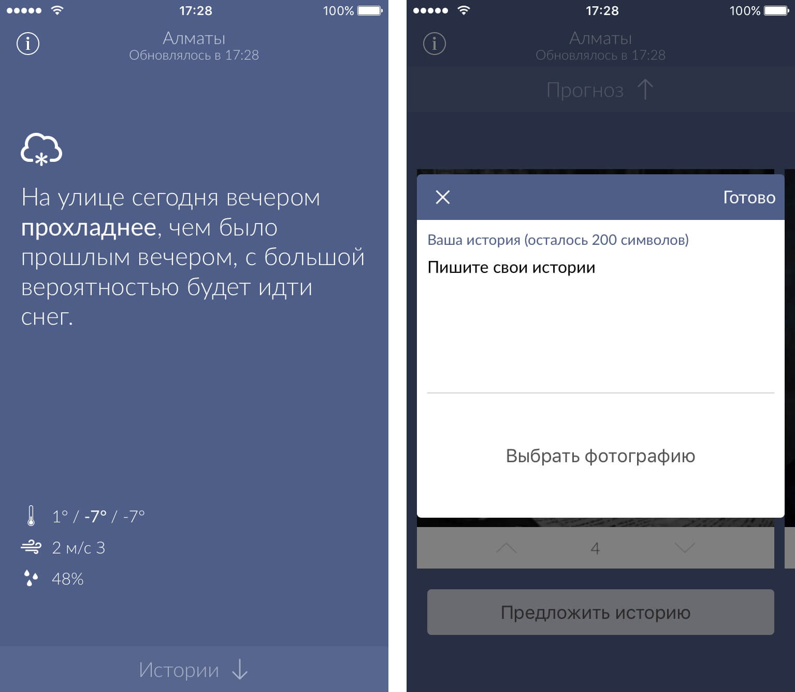

# Metio

Metio is an iOS app that displays your local weather in a simple, intuitive language.

[](http://apple.co/2hJ8WLo)



## Stack

Metio iOS code is written in Objective-C using the MVVM architecture. It's built with [ReactiveCocoa](https://github.com/ReactiveCocoa/ReactiveCocoa), [AFNetworking](https://github.com/AFNetworking/AFNetworking), and [Parse](https://github.com/ParsePlatform/Parse-SDK-iOS-OSX).

## Setup

1. Clone the repo

```bash
$ git clone https://github.com/anvilabs/metio
$ cd metio
```

2. Install dependencies from [CocoaPods](http://cocoapods.org/#install)

```bash
$ pod install
```

3. Configure the secret keys

```bash
$ cp Metio/Secrets-Example.h Metio/Secrets.h
$ open Metio/Secrets.h
# Paste your values
```

4. Open the Xcode workspace at `Metio.xcworkspace`.

## Credits

Loosely based on the [Tropos](https://github.com/thoughtbot/Tropos) project by thoughtbot, inc.

## License

[MIT License](./LICENSE) © Anvilabs
